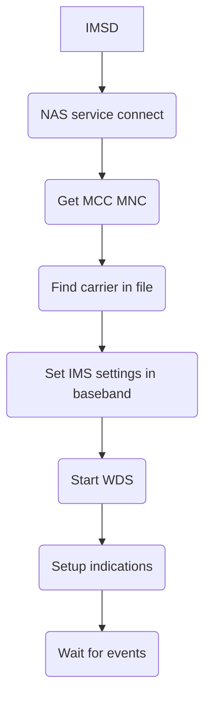
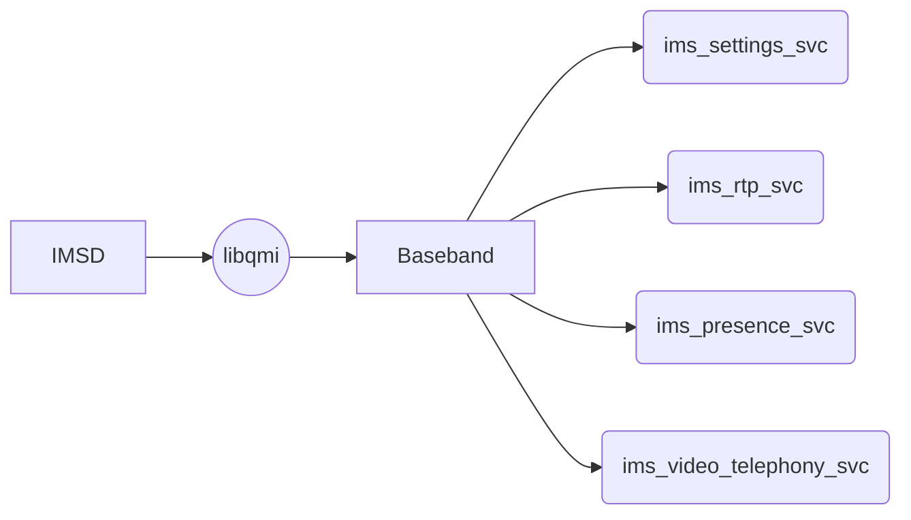

# IMSD

A small daemon to control IMS on Qualcomm Modems via QMI / QRTR.

IMSD's job is to configure the baseband inside a Qualcomm phone so it is able to establish an IMS session with the carrier, to allow VoLTE calls and messages to work. To accomplish this, imsd relies in libqmi to handle the actual communication with the baseband.

### How does it work (mostly)

### Supported communication channels:
- QMI
- QRTR

### Building
You'll need `meson`, `ninja`, `gcc`/`musl` and glibc, libqmi, libqrtr and related dev packages for this to work.

1. `meson setup build`
2. `ninja -C build`
3. Check if it works: `./build/imsd --device=qrtr://0`

